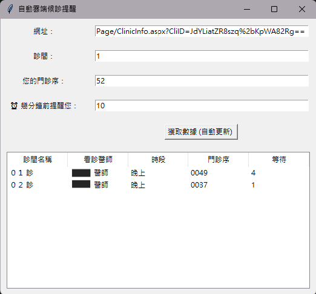

# 全國雲端候診中心自動提醒

這是一個基於 Python 的自動化工具，用於監控「全國雲端候診中心」的診間狀態，並在指定時間前提醒用戶。用戶只需輸入網址、診間、門診序號以及希望提前幾分鐘提醒，工具會自動監控診間狀態並在時間到時發出提醒。
全國雲端候診中心：https://wroom.vision.com.tw/MainPage.aspx

---

## 功能

- **自動監控診間狀態**：從「全國雲端候診中心」網站獲取診間資訊。
- **自定義提醒時間**：根據用戶輸入的門診序號和提前提醒時間，計算提醒時間。
- **鬧鈴提醒**：在指定時間觸發鬧鈴提醒用戶。
- **圖形化界面**：使用 `tkinter` 提供簡單易用的圖形化界面。

---

## 使用步驟

1. **輸入網址**：輸入當前診所的全國雲端候診中心的網址（例如：`https://wroom.vision.com.tw/MainPage/ClinicInfo.aspx?CliID=GFsICcr5K5CFuYtO5Ut06w==`）
2. **輸入診間**：輸入你要監控的診間名稱或代碼（例如：`1`、`第一`、`01`皆可）
3. **輸入門診序號**：輸入你的門診序號（例如：`15`）。
4. **設置提前提醒時間**：輸入你希望提前幾分鐘提醒，假設每個門診序號約需 5 分鐘。（例如：`30`）。
5. **開始監控**：點擊「獲取數據 (自動更新) 」按鈕，工具會自動監控診間狀態並在指定時間提醒你。

---

## 安裝與運行

### 環境需求

- Python 3.6 或更高版本
- Chrome 瀏覽器（用於 Selenium）
- ChromeDriver（與 Chrome 版本匹配）

### 安裝步驟

1. **複製專案**：
   ```bash
   git clone https://github.com/your-username/Auto_Doctor_Checker.git
   cd Auto_Doctor_Checker
   ```

2. **安裝需求**：
   ```bash
   pip install -r requirements.txt
   ```

3. **運行專案**：
   ```bash
   python DoctorChecker.py
   ```

---

## 依賴列表

以下是專案所需的 Python 庫：

```plaintext
tkinter
Pillow
selenium
pygame
word2number
roman
```

---

## 貢獻

歡迎提交 Issue 或 Pull Request 來改進此專案！

---

## 授權

此專案採用 [MIT 授權](LICENSE)。

---

## 截圖

  
*圖形化界面示例*

---

## 聯絡資訊

如有任何問題或建議，請聯繫：  
- 電子郵件：partner0487@gmail.com  
- GitHub：[partner0487](https://github.com/partner0487)

---

